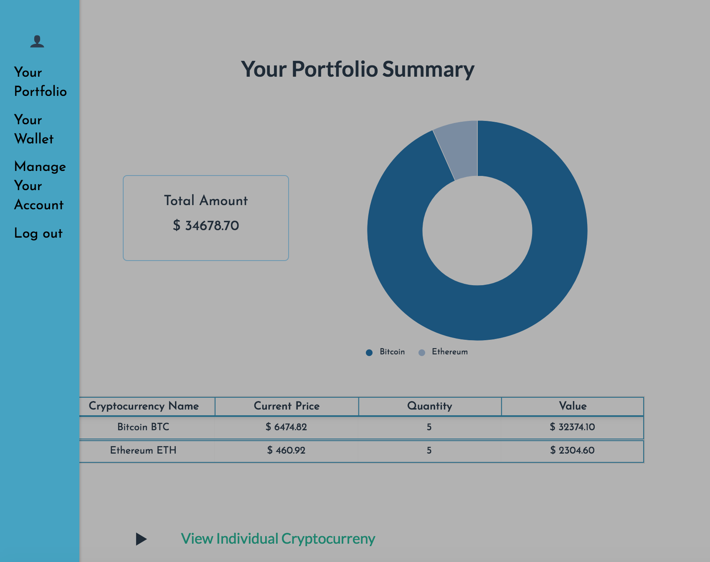
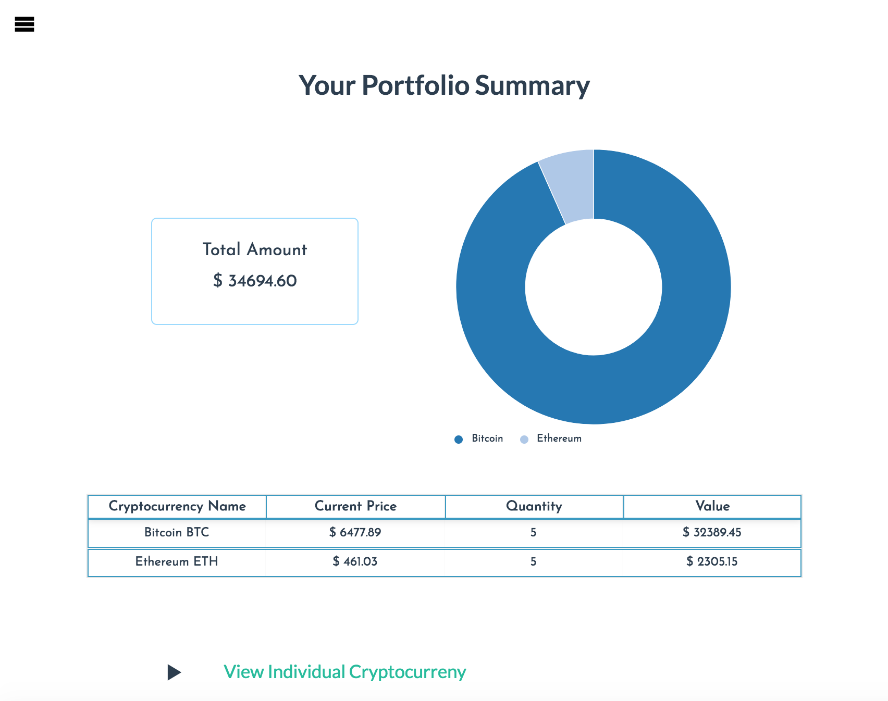
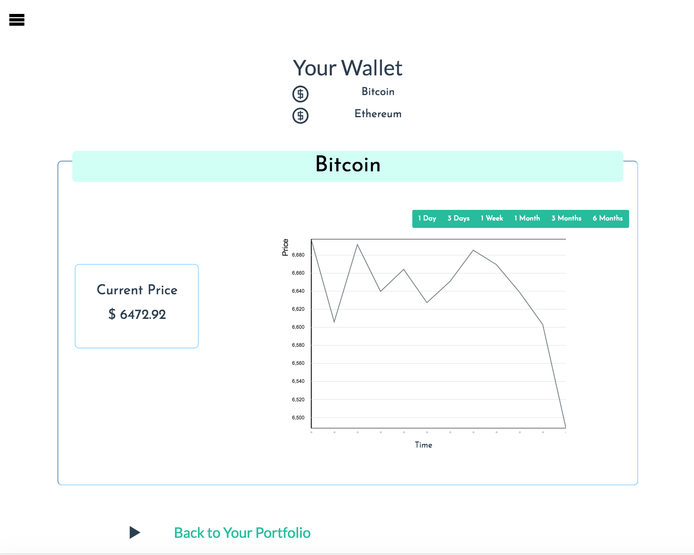
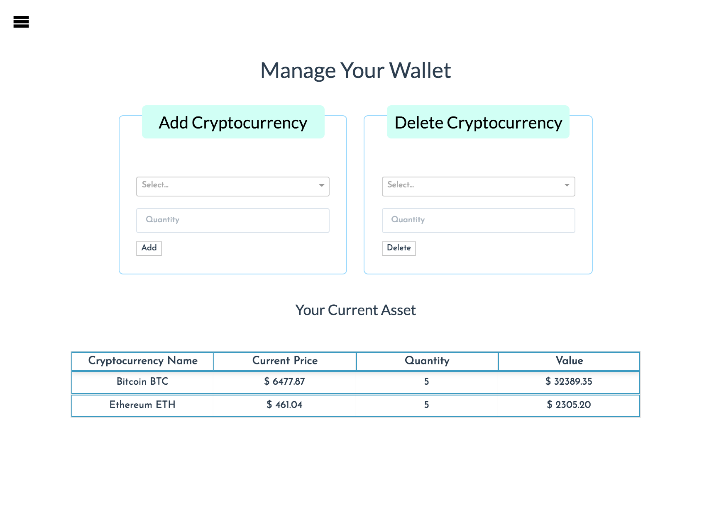

# CryptoPortfolio

Upon landing, an user is presented with a table showing the top 10 cryptocurrencies by total volume across all markets in the last 24 hours. 

After login, the user is presented with the account summary page "Your Portfolio" which shows the cryptocurrencies he/she has, the current value of each cryptocurrency, the amount of shares of each cryptocurrency he/she has and the total value of all cryptocurrencies. 

The user can navigate to the "Your Wallet" page and view the data of each cryptocurrency he/she has. 

To manage the account, navigate to "Manage Your Account" to add or remove cryptocurrency. 

### Prerequisites

Cryptoportfolio was built and tested with NodeJS v8.9.2, MySQL 5.7.20, ReactJS v16.4.0 and the following NPM packages:

| NPM Package     | Version |
| --------------- | ------- |
| axois | 0.18.0|
| bcryptjs   | 2.4.3   |
| body-parser     | 1.18.2  |
| dotenv          | 5.0.1   |
| express         | 4.16.2  |
| jsonwebtoken | 8.3.0 |
| jwt-decode | 2.2.0 |
| mysql           | 2.15.0  |
| mysql2          | 1.5.3   |
| passport        | 0.4.0   |
| passport-local | 1.0.0 |
| prop-types | 15.6.2 |
| react-dom | 16.2.0 |
| react-easy-chart | 1.0.0 |
| react-icons-kit | 1.1.5 |
| react-responsive | 4.1.0 |
| react-router-dom | 4.2.2 |
| react-select | 1.2.1 |
| react-sidebar | 2.3.2 |
| react-table | 6.8.6 |
| request | 2.87.0 |
| request-promise | 4.2.2 |
| sequelize | 4.37.10 |
| validator | 10.4.0 |